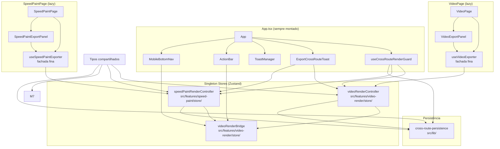
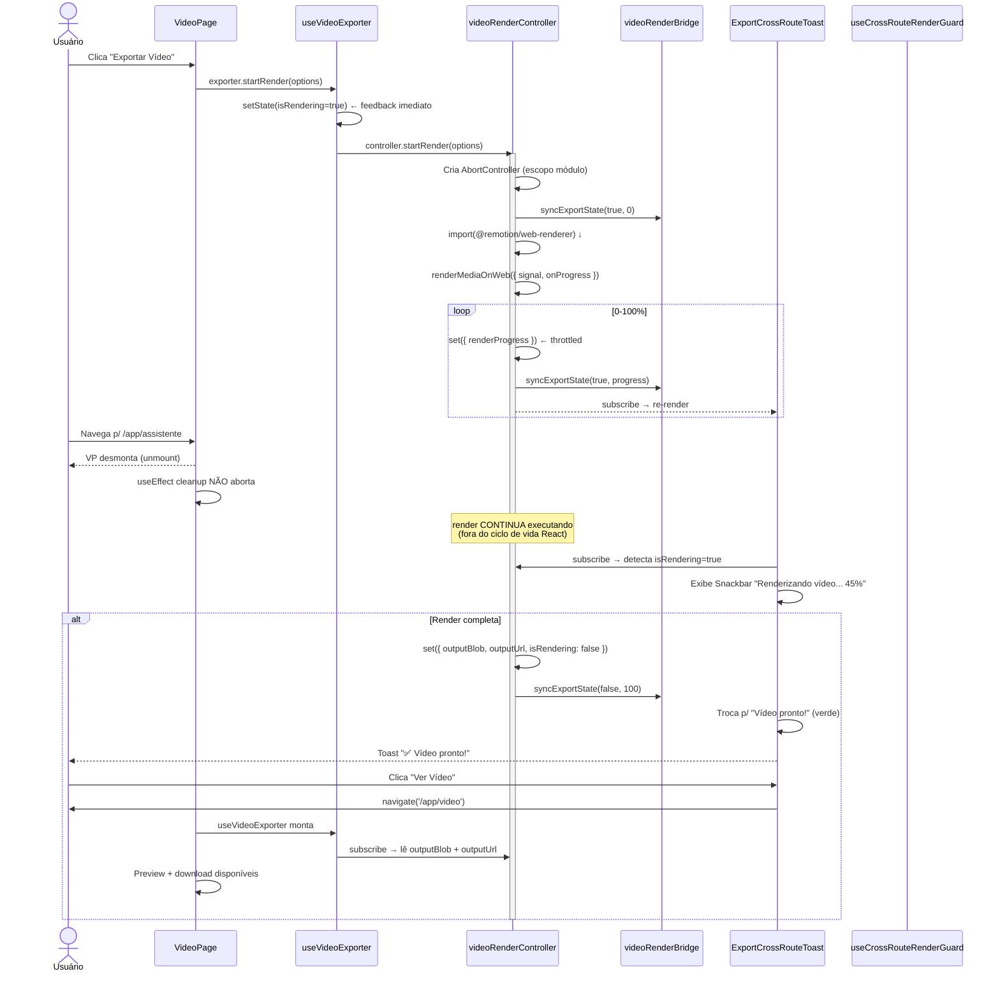

# Arquitetura — Video Render Survive Navigation

**Slug:** `video-render-survive-navigation`  
**Versão do projeto:** 0.122.0  
**Baseado em:** `requirements.md`, `base.md`, `product.md` + código real mapeado  

---

## 1. Diagrama de Componentes (Alto Nível)



### Fluxo de Dados (escrita/leitura)

| Escrita | Quem escreve | Quem lê |
|---------|-------------|----------|
| `isRendering`, `renderProgress` | M1 (via `set()`) | M3, M5, M6, M8 |
| `isRendering`, `renderProgress` | M1 → `syncExportState()` no bridge | `ActionBar`, `ToastManager` |
| `outputBlob`, `outputUrl` | M1 (via `set()`) | M3 (para download/preview) |
| `currentBatchIndex` | M2 (via `set()`) | M4, M6 |
| `isExportingVideo`, `videoExportProgress` | Bridge (escrito por M1) | `ActionBar`, `ToastManager` |

---

## 2. Diagrama de Sequência — Cenário Feliz



---

## 3. Detalhamento por Módulo (M1–M9)

### M9 — Tipos Compartilhados (P0)

**Responsabilidade:** Tipos base que M1, M2, M7, M8 consomem.

**Arquivo novo:** `src/features/video-render/types/renderController.ts` (~40 linhas)

```typescript
// --- Estados ---
export type RenderKind = 'video' | 'speed-paint';
export type RenderStatus =
  | 'idle'
  | 'preparing'
  | 'rendering'
  | 'completed'
  | 'cancelled'
  | 'failed';
export type RenderPhase =
  | 'speed-paint'     // Geração de strokes (antes do render)
  | 'composition'     // RenderMediaOnWeb ativo
  | 'finalizing';     // getBlob() + salvamento

// --- Snapshot para localStorage (M8) ---
export interface RenderSnapshot {
  schemaVersion: 1;
  kind: RenderKind;
  startedAt: number;           // Date.now() quando iniciou
  lastProgress: number;        // 0-100
  lastUpdatedAt: number;       // Date.now() do último progresso
  codec: string;               // 'h264' | 'vp8' | etc
  container: string;           // 'mp4' | 'webm'
  status: RenderStatus;
}

// --- Estado público do controller (read-only) ---
// NOTA: Este tipo é a "view" pública dos controllers M1/M2.
// Os controllers têm, internamente, mais campos privados (AbortController, etc).
export interface RenderControllerPublicState {
  kind: RenderKind;
  status: RenderStatus;
  isRendering: boolean;
  renderProgress: number;       // 0-100, inteiro
  renderStatusText: string;     // "Renderizando... 45%"
  outputBlob: Blob | null;
  outputUrl: string | null;
  error: string | null;
  startedAt: number | null;     // Date.now() quando startRender() foi chamado
  lastProgressUpdateAt: number; // Date.now() do último progresso
  codec: string;
  container: string;
}
```

Ações públicas (definidas separadamente):
```typescript
export interface RenderControllerActions {
  startRender: (options: unknown) => Promise<void>;
  cancelRender: () => void;
  reset: () => void;
}
```

**Dependências:** Nenhuma.  
**Critério de "pronto":** `bun run typecheck` passa; tipos importáveis sem `any`.

---

### M1 — `videoRenderController` (P0)

**Responsabilidade:** Store Zustand singleton que abriga o ciclo de vida do `renderMediaOnWeb` fora do componente React.

**Arquivo novo:** `src/features/video-render/store/videoRenderController.ts` (~250 linhas)

#### Shape do Store

```typescript
// --- Estado interno (privado do módulo) ---
// Estas variáveis vivem no closure do módulo, NÃO no Zustand.
let abortController: AbortController | null = null;
let currentRenderId = 0;         // Para detectar renders obsoletos
let remotionModule: typeof import('@remotion/web-renderer') | null = null;
const lastReportedPercentRef = { current: -1 };   // Objeto mutável, NÃO ref React

// --- Store Zustand ---
interface VideoRenderControllerStore extends RenderControllerPublicState {
  // Ações (acessíveis via getState() de qualquer lugar)
  startRender: (options: VideoExportOptions) => Promise<void>;
  cancelRender: () => void;
  reset: () => void;
}

export const videoRenderController = create<VideoRenderControllerStore>()(
  (set, get) => ({
    // --- Estado inicial ---
    kind: 'video',
    status: 'idle',
    isRendering: false,
    renderProgress: 0,
    renderStatusText: '',
    outputBlob: null,
    outputUrl: null,
    error: null,
    startedAt: null,
    lastProgressUpdateAt: 0,
    codec: 'h264',
    container: 'mp4',

    // --- Ações ---
    startRender: async (options) => {
      // 1. Cancela render anterior se existir
      if (get().isRendering) {
        abortController?.abort();
        abortController = null;
      }

      // 2. Cria novo ciclo
      const renderId = ++currentRenderId;
      abortController = new AbortController();
      const signal = abortController.signal;

      // 3. Reseta estado (exceto canRender, que não está aqui)
      set({
        status: 'preparing',
        isRendering: true,
        renderProgress: 0,
        renderStatusText: 'Preparando exportação...',
        outputBlob: null,
        outputUrl: null,
        error: null,
        startedAt: Date.now(),
        lastProgressUpdateAt: Date.now(),
      });

      // 4. Notifica bridge (D1.a)
      useVideoRenderBridge.getState().syncExportState(true, 0);

      // 5. Carrega remotion lazy (primeira vez)
      if (!remotionModule) {
        remotionModule = await import('@remotion/web-renderer');
      }

      // 6. Inicia render
      try {
        // ... monta composition, chama renderMediaOnWeb ...
        const result = await remotionModule.renderMediaOnWeb({
          composition,
          signal,
          onProgress: (progress) => {
            const percent = Math.round(progress.progress * 100);
            // Throttle: só atualiza se o inteiro mudou
            if (percent === lastReportedPercentRef.current) return;
            lastReportedPercentRef.current = percent;
            set({
              renderProgress: percent,
              renderStatusText: `Renderizando... ${percent}%`,
              lastProgressUpdateAt: Date.now(),
            });
            useVideoRenderBridge.getState().syncExportState(true, percent);
          },
          // ... demais opções ...
        });

        const blob = await result.getBlob();
        const url = URL.createObjectURL(blob);

        // Edge case: render foi cancelado durante getBlob()
        if (currentRenderId !== renderId) {
          URL.revokeObjectURL(url);
          return;
        }

        set({
          status: 'completed',
          isRendering: false,
          renderProgress: 100,
          renderStatusText: 'Exportação concluída!',
          outputBlob: blob,
          outputUrl: url,
        });
        useVideoRenderBridge.getState().syncExportState(false, 100);
      } catch (err) {
        if (currentRenderId !== renderId) return; // Render obsoleto
        // ... tratamento de erro ...
      }
    },

    cancelRender: () => {
      const state = get();
      // Se já completou, não descarta blob
      if (state.outputBlob) {
        set({ isRendering: false, status: 'cancelled' });
        useVideoRenderBridge.getState().syncExportState(false, state.renderProgress);
        return;
      }
      // Aborta e limpa
      abortController?.abort();
      abortController = null;
      URL.revokeObjectURL(state.outputUrl ?? '');
      set({
        isRendering: false,
        status: 'cancelled',
        outputBlob: null,
        outputUrl: null,
        renderProgress: 0,
      });
      useVideoRenderBridge.getState().syncExportState(false, 0);
      // Toast amarelo "Cancelado" é responsabilidade do consumidor
    },

    reset: () => {
      const url = get().outputUrl;
      if (url?.startsWith('blob:')) URL.revokeObjectURL(url);
      abortController?.abort();
      abortController = null;
      set({
        status: 'idle',
        isRendering: false,
        renderProgress: 0,
        renderStatusText: '',
        outputBlob: null,
        outputUrl: null,
        error: null,
        startedAt: null,
      });
      useVideoRenderBridge.getState().syncExportState(false, 0);
    },
  }),
);
```

#### API Pública

```typescript
// Uso imperativo (fora de componente):
import { videoRenderController } from './store/videoRenderController';
videoRenderController.getState().startRender(options);
videoRenderController.getState().cancelRender();

// Uso reativo (em componente):
import { useStore } from 'zustand';
const isRendering = useStore(videoRenderController, (s) => s.isRendering);
const progress = useStore(videoRenderController, (s) => s.renderProgress);

// Bridge sync:
import { useVideoRenderBridge } from './store/videoRenderBridge';
useVideoRenderBridge.getState().syncExportState(true, 50);
```

#### Edge Cases Cobertos

| Edge Case | Tratamento |
|-----------|-----------|
| `startRender` chamado 2x | `cancelRender()` implícito da anterior antes de iniciar nova |
| `cancelRender` após complete | Só reseta `isRendering`, não descarta blob |
| `reset` durante render | Aborta + limpa tudo |
| `getBlob()` demora > 30s | É assíncrono, não há timeout — aceitável |
| Navegação durante `getBlob()` | Render continua, signal não foi abortado |

**Dependências:** M9 (tipos), `videoRenderBridge`, `@remotion/web-renderer` (lazy import).  
**Critério de "pronto":** Testes unitários passam (5+ casos); `bun run typecheck` passa.

---

### M2 — `speedPaintRenderController` (P1)

**Responsabilidade:** Espelha M1 para speed paint, com suporte adicional a `currentBatchIndex` e `startBatchRender`.

**Arquivo novo:** `src/features/speed-paint/store/speedPaintRenderController.ts` (~250 linhas)

**Diferenças de M1:**

```typescript
// Campo adicional
export interface SpeedPaintControllerStore extends RenderControllerPublicState {
  currentBatchIndex: number;       // 0-indexed, 0 = single render
  totalBatchItems: number;         // 0 = single render, >0 = batch
  startRender: (options: SpeedPaintExportOptions) => Promise<void>;
  startBatchRender: (options: SpeedPaintBatchExportOptions) => Promise<void>;
  cancelRender: () => void;
  reset: () => void;
}
```

**Regra de conflito:** `startBatchRender` durante `startRender` em andamento → cancela o single e inicia o batch. `startRender` durante `startBatchRender` → cancela o batch e inicia o single. **Compartilham o mesmo `abortController`.**

**Dependências:** M9 (tipos).  
**Critério de "pronto":** Testes unitários passam (3+ casos); `currentBatchIndex` preservado durante navegação.

---

### M3 — `useVideoExporter` Refatorado (P0)

**Responsabilidade:** Fachada fina (~80 linhas) que preserva o contrato `VideoExporter` e delega para `videoRenderController`.

**Arquivo modificado:** `src/features/video-render/hooks/useVideoExporter.tsx` (523 → ~150 linhas)

#### Assinatura Pública Preservada

```typescript
// ESSE TIPO NÃO MUDA — contratos preservados
export type VideoExporter = {
  // Estado (vindo do controller + codecSupport)
  isRendering: boolean;
  renderProgress: number;
  renderStatusText: string;
  outputBlob: Blob | null;
  outputUrl: string | null;
  error: string | null;
  canRender: boolean | null;
  saveWarning: string | null;
  speedPaintWarnings: string[];
  resolvedVideoCodec: string;
  resolvedContainer: string;
  // Ações do codecSupport (locais)
  supportsHtmlInCanvas: boolean;
  checkSupport: (width: number, height: number) => Promise<void>;
  // Ações (delegam para o controller)
  startRender: (options: VideoExportOptions) => Promise<void>;
  handleCancel: () => void;
  handleDownload: () => void;
  dismissSaveWarning: () => void;
  reset: () => void;
};
```

#### Estrutura Interna da Fachada

```typescript
export function useVideoExporter(): VideoExporter {
  // 1. ⚠️ IMPORTANTE: NÃO chama useVideoExporter internamente (circular)
  //    Lê do controller singleton usando seletores primitivos
  const isRendering = useStore(videoRenderController, (s) => s.isRendering);
  const renderProgress = useStore(videoRenderController, (s) => s.renderProgress);
  const renderStatusText = useStore(videoRenderController, (s) => s.renderStatusText);
  const outputBlob = useStore(videoRenderController, (s) => s.outputBlob);
  const outputUrl = useStore(videoRenderController, (s) => s.outputUrl);
  const error = useStore(videoRenderController, (s) => s.error);
  // ... demais slices primitivas

  // 2. useCodecSupport permanece local (não migra para controller)
  const codecSupport = useCodecSupport({ muted: false });

  // 3. Sincroniza canRender do codecSupport (efeito local)
  const [canRender, setCanRender] = useState<boolean | null>(null);
  useEffect(() => {
    setCanRender(codecSupport.canRender);
  }, [codecSupport.canRender]);

  // 4. ⚠️ REMOVIDO: useEffect cleanup que abortava (linhas 178-186)
  //    O controller gerencia seu próprio AbortController

  // 5. Handlers thin — só delegam
  const startRender = useCallback(async (options: VideoExportOptions) => {
    // Sincroniza codecs antes de delegar
    await codecSupport.checkSupport(/* width, height */);
    await videoRenderController.getState().startRender(options);
  }, [codecSupport]);

  const handleCancel = useCallback(() => {
    videoRenderController.getState().cancelRender();
  }, []);

  const handleDownload = useCallback(() => {
    const url = videoRenderController.getState().outputUrl;
    if (!url) return;
    // ... downloadFile ...
    trackAnalyticsEvent('video_downloaded', { ... });
  }, []);

  // 6. useMemo retorna objeto estável (igual ao original)
  return useMemo(() => ({
    isRendering,
    renderProgress,
    // ... demais slices ...
    canRender,
    supportsHtmlInCanvas: codecSupport.supportsHtmlInCanvas,
    checkSupport: codecSupport.checkSupport,
    startRender,
    handleCancel,
    handleDownload,
    dismissSaveWarning,
    reset: () => videoRenderController.getState().reset(),
  }), [/* deps finas */]);
}
```

**Importante:** Cada slice é selecionada individualmente (`useStore(ctrl, (s) => s.isRendering)`) — **NÃO** selecionar objeto inteiro sem `useShallow`. Isso garante que consumidores como `VideoExportPanel` só re-renderizem quando a slice que eles usam muda.

**Dependências:** M1, M9, `videoRenderBridge` (para escrita).  
**Critério de "pronto":** Testes existentes passam (mockando M1); `bun run typecheck` passa; `VideoExportPanel` renderiza idêntico.

---

### M4 — `useSpeedPaintExporter` Refatorado (P1)

**Mesmo padrão de M3.**  

**Arquivo modificado:** `src/features/speed-paint/hooks/useSpeedPaintExporter.tsx` (714 → ~200 linhas)

**Diferenças de M3:**
- Consome `speedPaintRenderController` em vez de `videoRenderController`
- Expõe `startBatchRender` (delega para controller)
- Mantém `useCodecSupport({ muted: true })`
- Mantém toda a lógica de `getSpeedPaintSequenceTiming`
- `handleDownload` pode usar `currentBatchIndex` para nomear arquivo

**Dependências:** M2, M9.  
**Critério de "pronto":** Testes passam; SpeedPaintExportPanel funciona idêntico.

---

### M5 — `useCrossRouteRenderGuard` (P1)

**Responsabilidade:** Hook chamado uma vez em `App.tsx`. Centraliza `beforeunload`, `visibilitychange`, `document.title`.

**Arquivo novo:** `src/hooks/useCrossRouteRenderGuard.ts` (~80 linhas)

```typescript
import { useEffect, useRef } from 'react';
import { videoRenderController } from '../features/video-render/store/videoRenderController';
import { speedPaintRenderController } from '../features/speed-paint/store/speedPaintRenderController';

export function useCrossRouteRenderGuard(): void {
  const lastTitleRef = useRef('Script Master');
  const guardActiveRef = useRef(false);

  useEffect(() => {
    // Lê estado dos controllers (sempre atual via getState())
    const isAnyRendering = () =>
      videoRenderController.getState().isRendering ||
      speedPaintRenderController.getState().isRendering;

    const anyStatus = () =>
      videoRenderController.getState().status ||
      speedPaintRenderController.getState().status;

    // --- beforeunload ---
    const handleBeforeUnload = (event: BeforeUnloadEvent) => {
      if (!isAnyRendering()) return;
      event.preventDefault();
      // Edge case: navegador pode ignorar mensagem customizada
    };

    // --- visibilitychange + focus (re-hidrata última atualização) ---
    const handleVisibilityChange = () => {
      if (document.visibilityState === 'visible' && isAnyRendering()) {
        // Re-leitura já acontece via subscribe do Zustand
        // Só precisamos garantir que o Toast aparece
      }
    };

    // --- document.title dinâmico ---
    const updateTitle = () => {
      if (!isAnyRendering()) {
        document.title = 'Script Master';
        return;
      }
      const status = anyStatus();
      if (status === 'rendering') {
        document.title = '🎥 Renderizando — Script Master';
      } else if (status === 'completed') {
        document.title = '✅ Vídeo pronto! — Script Master';
      } else if (status === 'failed') {
        document.title = '❌ Falha na exportação — Script Master';
      } else {
        document.title = 'Script Master';
      }
    };

    // --- Polling de título (barato, 1s) ---
    // Usamos setInterval em vez de subscribe porque queremos
    // atualizar o title mesmo se o React não estiver renderizando.
    const titleInterval = setInterval(updateTitle, 1000);

    window.addEventListener('beforeunload', handleBeforeUnload);
    document.addEventListener('visibilitychange', handleVisibilityChange);

    return () => {
      clearInterval(titleInterval);
      window.removeEventListener('beforeunload', handleBeforeUnload);
      document.removeEventListener('visibilitychange', handleVisibilityChange);
    };
  }, []);
}
```

**Nota sobre `AudioGenerationHandler.tsx:163-173`:** O `beforeunload` inline lá **permanece** por enquanto, porque ele cobre `isGenerating` (geração de áudio). O M5 cobre `isRendering` (vídeo/speed paint). Eles são complementares, não conflitam. Uma futura refatoração pode unificar ambos.

**Dependências:** M1, M2.  
**Critério de "pronto":** `document.title` muda durante render; `beforeunload` dispara prompt nativo; testes passam.

---

### M6 — `ExportCrossRouteToast` (P1)

**Responsabilidade:** Snackbar MUI global, top-center, sem auto-dismiss, visível **apenas** quando `isRendering === true` e `pathname !== '/app/video' && pathname !== '/app/pintura-rapida'`.

**Arquivo novo:** `src/components/app/ExportCrossRouteToast.tsx` (~120 linhas)

#### Props

```typescript
interface ExportCrossRouteToastProps {
  // Sem props — lê direto dos controllers
}
```

#### Comportamento

```typescript
export function ExportCrossRouteToast(): React.ReactNode {
  const location = useLocation();
  const { t } = useLocale();
  const navigate = useNavigate();

  // Seletores primitivos (evita re-render desnecessário)
  const videoRendering = useStore(videoRenderController, (s) => s.isRendering);
  const videoProgress = useStore(videoRenderController, (s) => s.renderProgress);
  const videoStatus = useStore(videoRenderController, (s) => s.status);
  const videoError = useStore(videoRenderController, (s) => s.error);
  const videoKind = useStore(videoRenderController, (s) => s.kind);

  // Mesmo para speed paint
  const spRendering = useStore(speedPaintRenderController, (s) => s.isRendering);
  // ... (agrupado em um objeto com useShallow se necessário)

  // Determina se deve mostrar
  const isVideoPage = location.pathname === '/app/video';
  const isSpeedPaintPage = location.pathname === '/app/pintura-rapida';
  const show = (videoRendering || spRendering) && !isVideoPage && !isSpeedPaintPage;

  // Estado do toast: rendering / completed / failed
  const toastKind = videoRendering || spRendering ? 'rendering' :
    videoStatus === 'completed' || videoStatus === 'failed' ? videoStatus : null;

  return (
    <Snackbar
      open={show || videoStatus === 'completed' || videoStatus === 'failed'}
      anchorOrigin={{ vertical: 'top', horizontal: 'center' }}
      autoHideDuration={null}               // NÃO fecha sozinho
      slotProps={{
        content: { role: 'alert' },
      }}
    >
      <Alert
        severity={toastKind === 'failed' ? 'error' : toastKind === 'completed' ? 'success' : 'info'}
        variant="filled"
        icon={toastKind === 'rendering' ? <CircularProgress size={20} color="inherit" /> : undefined}
        action={
          <Stack direction="row" spacing={1}>
            {toastKind === 'rendering' && (
              <>
                <Button size="small" color="inherit" onClick={() => navigate('/app/video')}>
                  {t('exportCrossRoute.actionViewVideo')}
                </Button>
                <Button size="small" color="inherit" onClick={() => videoRenderController.getState().cancelRender()}>
                  {t('exportCrossRoute.actionCancel')}
                </Button>
              </>
            )}
            {toastKind === 'completed' && (
              <>
                <Button size="small" color="inherit" onClick={() => navigate('/app/video')}>
                  {t('exportCrossRoute.actionViewVideo')}
                </Button>
                <Button size="small" color="inherit" onClick={() => downloadVideo()}>
                  {t('exportCrossRoute.actionDownload')}
                </Button>
              </>
            )}
            {toastKind === 'failed' && (
              <>
                <Button size="small" color="inherit" onClick={() => navigate('/app/video')}>
                  {t('exportCrossRoute.actionSeeDetails')}
                </Button>
              </>
            )}
          </Stack>
        }
      >
        {toastKind === 'rendering' && (
          <Stack direction="row" spacing={1.5} sx={{ alignItems: 'center' }}>
            <Typography variant="body2" sx={{ fontWeight: 600 }}>
              {t('exportCrossRoute.renderingTitle')}
            </Typography>
            <Typography variant="body2" sx={{ fontFamily: 'JetBrains Mono' }}>
              {videoProgress}%
            </Typography>
          </Stack>
        )}
        {toastKind === 'completed' && t('exportCrossRoute.completedTitle')}
        {toastKind === 'failed' && `${t('exportCrossRoute.failedTitle')}: ${videoError}`}
      </Alert>
    </Snackbar>
  );
}
```

#### Onde Montar

Em `App.tsx`, após o `<Toaster />` e antes do `<Header />`:

```typescript
// App.tsx
<Toaster ... />
<ExportCrossRouteToast />    {/* NOVO: sempre montado */}
<Header />
```

#### i18n

Namespace `exportCrossRoute` adicionado em `pt-BR.ts`, `en.ts`, `es.ts` (19 chaves — ver §5 do product.md).

#### Acessibilidade

- `slotProps.content={{ role: 'alert' }}` → leitores de tela anunciam
- `aria-live="polite"` herdado do `Alert` MUI
- Botões com `aria-label` implícito pelo texto
- Foco **NÃO** é movido automaticamente ao toast (evita desorientação)

**Dependências:** M1, M2.  
**Critério de "pronto":** Teste manual: navegar com render ativo vê toast; `bun test` passa.

---

### M7 — `ExportSurviveIndicator` (P2)

**Responsabilidade:** Banner no topo de `VideoPage` (ou `SpeedPaintPage`) quando o componente monta e o controller já tem `status === 'rendering'` com `startedAt < Date.now() - 1000`.

**Arquivo novo:** `src/features/video-render/components/ExportSurviveIndicator.tsx` (~80 linhas)

Usa `Alert` MUI com `severity="info"` e botões "Continuar" (navega para `/app/video`) e "Cancelar".

**Lógica de detecção:**
```typescript
const startedBeforeMount =
  videoRenderController.getState().startedAt !== null &&
  Date.now() - videoRenderController.getState().startedAt > 1000;
// Mostra banner APENAS se o render começou antes do mount desta página
```

**Dependências:** M1, M2, M9.  
**Critério de "pronto":** Banner aparece ao montar VideoPage com render em andamento > 1s.

---

### M8 — `cross-route-persistence` (P2)

**Responsabilidade:** Salva/limpa snapshot em `localStorage` (chave `s2a_active_render`) para sobreviver a F5.

**Arquivo novo:** `src/lib/cross-route-persistence.ts` (~80 linhas)

```typescript
const STORAGE_KEY = 's2a_active_render';
const SCHEMA_VERSION = 1;

export function saveActiveRender(snapshot: RenderSnapshot): void {
  try {
    localStorage.setItem(STORAGE_KEY, JSON.stringify(snapshot));
  } catch {
    // Quota ou SecurityError — falha silenciosa
  }
}

export function loadActiveRender(): RenderSnapshot | null {
  try {
    const raw = localStorage.getItem(STORAGE_KEY);
    if (!raw) return null;
    const parsed = JSON.parse(raw) as RenderSnapshot;
    if (parsed.schemaVersion !== SCHEMA_VERSION) {
      clearActiveRender(); // Schema antigo — limpa
      return null;
    }
    return parsed;
  } catch {
    return null; // JSON inválido — ignora
  }
}

export function clearActiveRender(): void {
  try {
    localStorage.removeItem(STORAGE_KEY);
  } catch {
    // falha silenciosa
  }
}
```

**Schema:**
```typescript
interface RenderSnapshot {
  schemaVersion: 1;
  kind: 'video' | 'speed-paint';
  startedAt: number;
  lastProgress: number;     // 0-100
  codec: string;
  container: string;
  status: 'preparing' | 'rendering';
}
```

**Onde salvar:** No `set()` de M1/M2, após cada atualização de progresso (debounce 1s via ref).  
**Onde carregar:** Em `App.tsx` no mount, verificar se há snapshot — proteger `beforeunload`.  
**Onde limpar:** Em `cancelRender()`, `reset()` e ao completar.

**Dependências:** M9.  
**Critério de "pronto":** F5 durante render → `loadActiveRender()` retorna snapshot; limpeza após conclusão.

---

## 4. Migrations de Imports

### Arquivos que **DEVEM** continuar importando `useVideoExporter` (não mudam)

| Arquivo | Importa | Razão |
|---------|---------|-------|
| `src/pages/VideoPage.tsx` | `useVideoExporter` | Consumidor principal |
| `src/features/video-render/components/VideoExportPanel.tsx` | `VideoExporter` type | Props recebem o exportador |
| `tests/video-render/useVideoExporter-speedpaint.unit.test.tsx` | `useVideoExporter` | Testes |

### Arquivos que **PASSAM** a importar do controller diretamente ou do bridge

| Arquivo | Importa atualmente | Novo import | Mudança |
|---------|-------------------|-------------|---------|
| `src/components/toast/ToastProvider.tsx` | `isExportingVideo` via props | (já via props) | Nenhuma — props continuam |
| `src/components/ActionBar.tsx` | `useVideoRenderBridge` | Mantém | Nenhuma |
| `src/components/app/AudioGenerationHandler.tsx:14` | `useVideoRenderBridge` | Mantém | Nenhuma |
| `src/pages/VideoPage.tsx:216` | `syncExportState(...)` | **Removido** — agora é M1 quem chama | Muda no VideoPage |

### Arquivo que **REMOVERÁ** a chamada a `syncExportState`

**`src/pages/VideoPage.tsx:215-217`:**
```typescript
// ANTES (remover):
useEffect(() => {
  useVideoRenderBridge.getState().syncExportState(videoExporter.isRendering, videoExporter.renderProgress);
}, [videoExporter.isRendering, videoExporter.renderProgress]);

// DEPOIS (removido) — M1 chama syncExportState internamente
```

### Arquivo que **REMOVERÁ** o `resetBridge`

**`src/pages/VideoPage.tsx:224-226`:**
```typescript
// ANTES (remover):
useEffect(() => {
  return () => { useVideoRenderBridge.getState().resetBridge(); };
}, []);

// DEPOIS (removido) — bridge não é resetado no unmount
// O bridge reflete o estado do controller,
// que continua vivo fora do componente
```

---

## 5. Tabela de Compatibilidade

| Tipo | Onde é exportado | Antes | Depois | Compatível? |
|------|-----------------|-------|--------|-------------|
| `VideoExporter` | `useVideoExporter.tsx` | `ReturnType<typeof useVideoExporter>` | `ReturnType<typeof useVideoExporter>` | ✅ **Idêntico** |
| `VideoExportOptions` | `useVideoExporter.tsx` | Interface | Interface (mesma) | ✅ **Idêntico** |
| `SpeedPaintExporter` | `useSpeedPaintExporter.tsx` | `ReturnType<typeof useSpeedPaintExporter>` | `ReturnType<typeof useSpeedPaintExporter>` | ✅ **Idêntico** |
| `SpeedPaintExportOptions` | `useSpeedPaintExporter.tsx` | Interface | Interface (mesma) | ✅ **Idêntico** |
| `SpeedPaintBatchExportOptions` | `useSpeedPaintExporter.tsx` | Interface | Interface (mesma) | ✅ **Idêntico** |
| `videoRenderController` | NOVO | — | Zustand store | **Novo** (imperativo) |
| `speedPaintRenderController` | NOVO | — | Zustand store | **Novo** (imperativo) |
| `videoRenderBridge` | Existente | Store | Store (M1 escreve) | ✅ **Mantido** |
| `RenderControllerPublicState` | NOVO | — | Type | **Novo** |
| `RenderSnapshot` | NOVO | — | Type | **Novo** |

`VideoExportPanel.tsx` recebe `exporter: VideoExporter` → `useVideoExporter()` retorna `VideoExporter` → **sem quebra.**

`SpeedPaintExportPanel.tsx` recebe `exporter: SpeedPaintExporter` → `useSpeedPaintExporter()` retorna `SpeedPaintExporter` → **sem quebra.**

---

## 6. Esquema de Estado Compartilhado

```
videoRenderController.getState()
├── kind: 'video'
├── status: 'idle' | 'preparing' | 'rendering' | 'completed' | 'cancelled' | 'failed'
├── isRendering: boolean
├── renderProgress: number         // 0-100, inteiro (throttled)
├── renderStatusText: string
├── outputBlob: Blob | null
├── outputUrl: string | null
├── error: string | null
├── startedAt: number | null       // Date.now()
├── lastProgressUpdateAt: number   // Date.now()
├── codec: string                  // 'h264' | 'vp8'
├── container: string              // 'mp4' | 'webm'
│
├── startRender: (options) => Promise<void>
├── cancelRender: () => void
└── reset: () => void

speedPaintRenderController.getState()
├── (mesmos campos de videoRenderController)
├── currentBatchIndex: number      // 0 = single, 1-N = batch
├── totalBatchItems: number
│
├── startRender: (options) => Promise<void>
├── startBatchRender: (options) => Promise<void>
├── cancelRender: () => void
└── reset: () => void

videoRenderBridge.getState()
├── isExportingVideo: boolean      // ← escrito por M1
├── videoExportProgress: number    // ← escrito por M1
├── isTranscribing: boolean        // ← mantido igual
├── transcriptionProgress: number
├── transcriptionStatusText: string
├── currentFrame: number
├── isPlaying: boolean
│
├── syncExportState: (rendering, progress) => void
├── syncTranscriptionState: (transcribing, progress, text) => void
├── syncCurrentFrame: (frame) => void
├── syncIsPlaying: (playing) => void
└── resetBridge: () => void
```

---

## 7. Fluxo de Erro Detalhado

| Cenário | Onde ocorre | Ação do sistema | UI Feedback |
|---------|------------|-----------------|-------------|
| **OOM durante render** | M1 `renderMediaOnWeb()` | Promise rejeita → `catch` trata | Toast vermelho: "Falha na exportação: memória insuficiente" + "Ver detalhes" |
| **Codec não suportado** | `renderMediaOnWeb()` | Rejeita com erro de codec | Toast vermelho + painel com "Tente com qualidade menor" |
| **Usuário cancela no Toast** | M6 `cancelRender()` | M1.cancelRender() → abortController.abort() | Toast progresso SOME + toast amarelo 4s "Renderização cancelada" |
| **Usuário navega durante cancelamento** | cleanup de rota | Controller já abortou — seguro | Nada — toast amarelo aparece na rota destino |
| **Duplo clique em Exportar** | M3 `startRender()` | M1 detecta `isRendering === true` → aborta anterior e inicia nova | Progresso "pula" (1ª → 2ª) — aceitável |
| **Exportação de 2 cenas (impossível)** | UI (RF-010) | Só 1 ativo por vez — próxima cancela anterior | Toast reflete a 2ª |
| **Conflito áudio + vídeo** | Ambos ativos | Áudio usa `AudioGenerationHandler`, vídeo usa M1 — **são independentes** | Nenhum conflito |
| **getBlob() lento (>30s)** | M1 `result.getBlob()` | Aguarda — sem timeout | Progresso em 100% com "Finalizando..." |
| **F5 durante render** | Página recarrega | M1 morto, M8 carrega snapshot | Banner: "Renderização interrompida — reiniciar" (apenas em `/app/video`) |
| **Navegação para rota pública** | SPA | Usuário desloga → providers reiniciam → controller perde referência | Render é perdido (documentado em RF-001 exceções) |

---

## 8. Plano de Testes

### Estrutura de diretórios

```
tests/
├── video-render/
│   ├── videoRenderController.unit.test.ts       ★ NOVO (5+ casos)
│   ├── videoRenderBridge.unit.test.ts            (mantido)
│   ├── ExportSurviveIndicator.component.test.tsx   ★ NOVO (2+ casos)
│   └── useVideoExporter-speedpaint.unit.test.tsx   (ajustado mock)
├── speed-paint/
│   └── speedPaintRenderController.unit.test.ts   ★ NOVO (3+ casos)
├── components/
│   └── ExportCrossRouteToast.component.test.tsx  ★ NOVO (3+ casos)
├── hooks/
│   └── useCrossRouteRenderGuard.unit.test.ts     ★ NOVO (3+ casos)
└── lib/
    └── cross-route-persistence.unit.test.ts      ★ NOVO (3+ casos)
```

### Casos de Teste por Módulo

#### `videoRenderController.unit.test.ts` (5+ casos)
1. **Estado inicial:** `isRendering === false`, `outputBlob === null`
2. **startRender mockado:** `renderMediaOnWeb` mock → `isRendering` fica `true`, progresso avança
3. **cancelRender preserva blob completo:** se `outputBlob` já existe, cancel não descarta
4. **reset limpa URL:** `outputUrl` é `null` após reset
5. **Paralelismo de 2 renders:** `startRender` 2x → primeira é abortada, segunda continua

#### `speedPaintRenderController.unit.test.ts` (3+ casos)
1. **batch não aborta ao navegar:** `startBatchRender` → estado não muda sem abort
2. **currentBatchIndex preservado:** índice avança e é legível
3. **Conflito batch vs single:** batch durante single → single é abortado

#### `ExportCrossRouteToast.component.test.tsx` (3+ casos)
1. **Aparece em `/app/assistente`:** mock `location.pathname='/app/assistente'`, controller `isRendering=true` → toast visível
2. **Não aparece em `/app/video`:** mesmo mock mas pathname `/app/video` → toast oculto
3. **Estados rendering/completed/failed:** 3 snapshots diferentes

#### `useCrossRouteRenderGuard.unit.test.ts` (3+ casos)
1. **beforeunload registrado com render ativo:** `addEventListener` spy chamado
2. **Removido sem render:** listener removido no cleanup
3. **Mensagem customizada presente:** evento contém `preventDefault()` chamado

#### `ExportSurviveIndicator.component.test.tsx` (2+ casos)
1. **Banner aparece:** montar com `startedAt < Date.now() - 1000` e `isRendering=true`
2. **Não aparece sem render:** `startedAt=null` → banner oculto

#### `cross-route-persistence.unit.test.ts` (3+ casos)
1. **save/load/clear:** ciclo completo funciona
2. **Schema versionado:** schema diferente retorna `null`
3. **JSON inválido:** `localStorage` corrompido retorna `null`

---

## 9. Riscos Técnicos com Mitigação

| # | Risco | Magnitude | Mitigação |
|---|-------|-----------|-----------|
| **R1** | `beforeunload` do `AudioGenerationHandler` conflita com M5 | Baixa | São complementares — um cobre geração de áudio, outro cobre render. Sem sobreposição. |
| **R2** | `resetBridge()` no unmount de `VideoPage` (linha 225) limpa estado que M1 acabou de escrever | **Média** | ✅ **Remover** o `resetBridge()` do cleanup de `VideoPage`. Bridge agora é escrito por M1, que não desmonta. |
| **R3** | Re-render excessivo em `ToastManager`/`ActionBar` por causa de progresso 30x/s | Média | Já mitigado: bridge seleciona slices primitivas. M1 usa throttle de percentual inteiro. |
| **R4** | `useEffect` legado em `useVideoExporter` que ainda aborta | Média | **Remover** linhas 178-186. Code review obrigatório. Testes verificam que cleanup não aborta. |
| **R5** | `@remotion/web-renderer` lazy import falha na primeira vez (CDN, restrição COEP) | Alta | `try/catch` no import(). Se falhar, `set({ error: 'Falha ao carregar módulo de renderização' })`. Fallback: sugerir recarregar a página. |
| **R6** | Múltiplas instâncias de `useVideoExporter` compartilham controller mas cada uma tem seu `useCodecSupport` | Baixa | Projetado: `useCodecSupport` é hook local. Controller não gerencia codec. Consumidores podem ter diferentes codecSupport sem conflito. |
| **R7** | Snapshot M8 em `localStorage` excede quota (raro) | Baixa | `try/catch` em todas as operações. Falha silenciosa. |
| **R8** | Speed paint + vídeo ativos simultaneamente competindo por recursos (GPU, memória) | Média | Arquitetura permite ambos. Se houver OOM, um dos dois falha. Toast de erro informa. Usuário pode cancelar um deles. |

---

## 10. Ordem de Execução

**Mantém a ordem do base plan** (não altera):

| Passo | Módulo | Prioridade | Estimativa | Depende de |
|-------|--------|-----------|------------|------------|
| 1 | M9 — Tipos | P0 | 30 min | — |
| 2 | M1 — videoRenderController | P0 | 4h | M9 |
| 3 | M3 — useVideoExporter refactor | P0 | 3h | M1, M9 |
| 4 | M5 — useCrossRouteRenderGuard | P1 | 1h | M1, M2 |
| 5 | M6 — ExportCrossRouteToast | P1 | 2h | M1, M2 |
| 6 | M2 — speedPaintRenderController | P1 | 3h | M9 |
| 7 | M4 — useSpeedPaintExporter refactor | P1 | 2h | M2, M9 |
| 8 | M7 — ExportSurviveIndicator | P2 | 1.5h | M1, M2 |
| 9 | M8 — cross-route-persistence | P2 | 1h | M9 |

**PR recomendado:** PR1 (passos 1-5, ~10h), PR2 (passos 6-9, ~7.5h).

**Justificativa para não alterar a ordem:** M1 e M3 são o core do fix (P0). M5 e M6 são a UX que o usuário vê. M2 e M4 são espelho (speed paint). M7 e M8 são polish.

---

## 11. Decisões Arquiteturais Abertas

### D1 — Coexistência M1 ↔ `videoRenderBridge` (já decidida: D1.a)

✅ **M1 escreve no bridge.** O bridge mantém `isTranscribing`, `currentFrame`, `isPlaying` (não migram). M1 escreve `isExportingVideo` + `videoExportProgress` via `syncExportState()`.

**Impacto:** Nenhuma mudança em `ActionBar`, `ToastManager`, `AudioGenerationHandler` — eles continuam lendo do bridge como antes.

### D2 — Posicionamento do `ExportCrossRouteToast` (já decidida: D3.a)

✅ **Snackbar MUI global em `App.tsx`, top-center, ao lado do `<Toaster />`.**

**Justificativa:** O `ToastManager` existente já renderiza um Snackbar de exportação similar (linhas 52-94), mas ele some quando o usuário navega porque `ToastManager` recebe `isExportingVideo` via props de `App.tsx`. O novo `ExportCrossRouteToast` lê direto do controller, então sobrevive.

**Importante:** `ToastManager` continuará existindo para `activeError`, `warning`, `successMessage`. O novo toast é **complementar**.

### D3 — Speed paint no mesmo PR ou separado? (AGUARDA USUÁRIO)

A arquitetura está desenhada para ambos os cenários. O documento trata M2/M4 como módulos separados. Se a decisão for PR separado, executar passos 1-5 (PR1), depois 6-9 (PR2). Se for mesmo PR, executar 1-9 em ordem.

### D4 — Banner pós-F5: só em `/app/video`? (já decidida: sim)

✅ Banner pós-F5 aparece **apenas em `/app/video`**. Em outras rotas, o snapshot serve apenas para `beforeunload`.

### D5 — `resetBridge` removido do unmount de `VideoPage`

✅ Decisão já tomada: bridge não é resetado no unmount. M1 escreve nele. O `useEffect` cleanup `return () => { useVideoRenderBridge.getState().resetBridge(); }` (linha 225 de VideoPage.tsx) **será removido**.

---

## 12. Telemetria (RNF-007)

### Novo evento de analytics

```typescript
// Em src/lib/analytics.ts, dentro de AnalyticsEventMap:
video_export_completed_offroute: ExportParams & { source: string };
```

### Onde emitir

No M1, após o `set()` que marca `status: 'completed'`:

```typescript
// Dentro de videoRenderController.ts, catch/try do startRender:
if (currentRenderId !== renderId) return;
set({ status: 'completed', isRendering: false, ... });

// Verifica se o usuário está em rota diferente
const currentPath = window.location.pathname;
if (currentPath !== '/app/video' && currentPath !== '/app/pintura-rapida') {
  trackAnalyticsEvent('video_export_completed_offroute', {
    quality: options.quality,
    codec: get().codec,
    container: get().container,
    scene_count: options.scenes.length,
    source: currentPath,
  });
}
```

### Eventos existentes mantidos

Os hooks fachada (M3/M4) continuam emitindo `video_export_started`, `_completed`, `_cancelled`, `_failed` — sem mudanças.

---

## 13. Acessibilidade (RNF-005)

| Componente | Atributo | Comportamento |
|-----------|----------|---------------|
| `ExportCrossRouteToast` | `slotProps.content={{ role: 'alert' }}` | Leitores de tela anunciam "Renderizando vídeo... 45%" |
| `ExportCrossRouteToast` | `aria-live="polite"` (herdado do `Alert`) | Anúncio não-interruptivo |
| Botão "Cancelar" | `aria-label` vindo do texto | Navegação por teclado: Tab → Enter |
| Dot indicator mobile | `aria-label` dinâmico | `"Renderização em andamento"` ou `"Vídeo pronto para ver"` |
| Foco automático | ❌ **Não** mover foco ao toast | Evita desorientação do usuário |

---

## 14. Resumo de Entregáveis

| Arquivo | Status | Linhas (est.) |
|---------|--------|--------------|
| `src/features/video-render/types/renderController.ts` | NOVO | ~40 |
| `src/features/video-render/store/videoRenderController.ts` | NOVO | ~250 |
| `src/features/speed-paint/store/speedPaintRenderController.ts` | NOVO | ~250 |
| `src/features/video-render/hooks/useVideoExporter.tsx` | EDIT | 523 → ~150 |
| `src/features/speed-paint/hooks/useSpeedPaintExporter.tsx` | EDIT | 714 → ~200 |
| `src/hooks/useCrossRouteRenderGuard.ts` | NOVO | ~80 |
| `src/components/app/ExportCrossRouteToast.tsx` | NOVO | ~120 |
| `src/features/video-render/components/ExportSurviveIndicator.tsx` | NOVO | ~80 |
| `src/lib/cross-route-persistence.ts` | NOVO | ~80 |
| `src/lib/analytics.ts` | EDIT | +3 linhas (evento novo) |
| `src/pages/VideoPage.tsx` | EDIT | -6 linhas (remove syncExportState + resetBridge) |
| `src/components/toast/ToastProvider.tsx` | EDIT | -43 linhas (remove Snackbar de exportação — agora no novo toast) |
| `src/features/video-render/store/videoRenderBridge.ts` | EDIT | +comentário (M1 escreve aqui) |
| Locales (3 arquivos) | EDIT | +19 chaves cada |

### ToastProvider mudança importante

O `ToastManager` atual (linhas 52-94) renderiza um Snackbar de progresso de exportação **que será removido**. O novo `ExportCrossRouteToast` substitui essa funcionalidade com comportamento cross-route. O `ToastManager` manterá apenas `ErrorToast`, `WarningToast`, `SuccessToast`.

---

## 15. Checklist de Conclusão para o Worker

### Antes de começar a implementar

- [ ] Usuário respondeu D3 (speed paint mesmo PR ou separado)?
- [ ] `bun run typecheck` passa na branch atual
- [ ] `bun test` passa na branch atual

### Durante a implementação (por módulo)

- [ ] M9: tipos exportados, `bun run typecheck` passa
- [ ] M1: `bun test tests/video-render/videoRenderController.unit.test.ts` passa
- [ ] M3: `bun test tests/video-render/useVideoExporter-speedpaint.unit.test.tsx` passa (mock ajustado)
- [ ] M5: `bun test tests/hooks/useCrossRouteRenderGuard.unit.test.ts` passa
- [ ] M6: `bun test tests/components/ExportCrossRouteToast.component.test.tsx` passa
- [ ] M2: `bun test tests/speed-paint/speedPaintRenderController.unit.test.ts` passa
- [ ] M4: `bun test tests/speed-paint/useSpeedPaintExporter.unit.test.tsx` passa (mock ajustado)
- [ ] M7: `bun test tests/video-render/ExportSurviveIndicator.component.test.tsx` passa
- [ ] M8: `bun test tests/lib/cross-route-persistence.unit.test.ts` passa

### Após tudo implementado

- [ ] `bun run typecheck` sem erros
- [ ] `bun test` — todos os testes (novos + existentes) verdes
- [ ] `bun run build` — build de produção bem-sucedido
- [ ] Teste manual: iniciar export, navegar, voltar, ver blob preservado
- [ ] Teste manual: F5 durante render mostra banner (apenas `/app/video`)

---

**Documento gerado em:** 2026-06-02  
**Responsável:** Architecture Agent  
**Arquivo:** `docs/plan/video-render-survive-navigation-architecture.md`
