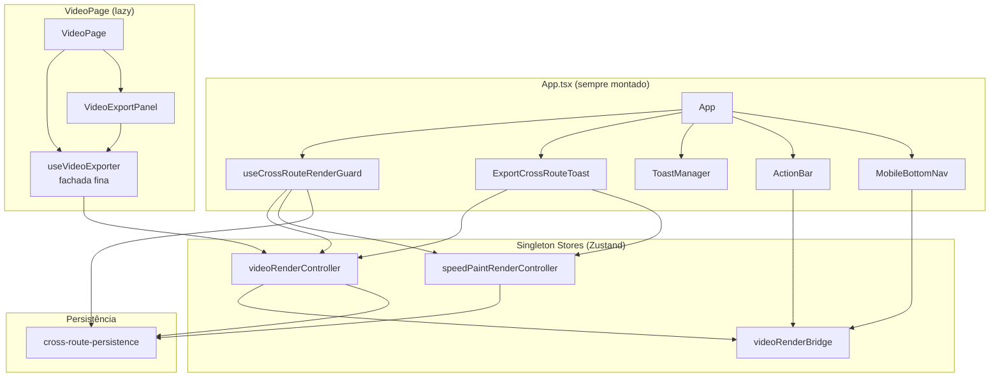

# Plano Final — `video-render-survive-navigation`

> **Resumo em 1 linha:** Tornar a renderização de vídeo (e speed paint) resistente à navegação entre rotas da SPA, com persistência leve em `localStorage` para sobreviver a F5.

**Slug:** `video-render-survive-navigation`
**Versão do projeto:** 0.122.0
**Status:** Aguardando sign-off de 3 decisões do usuário (ver §3.1). Pronto para execução após isso.
**Modo:** Padrão (plano completo, cross-validation feita, gaps catalogados).

**Arquivos do plano (cross-validation chain):**
- [`base.md`](./video-render-survive-navigation-base.md) — planner (9 módulos M1–M9)
- [`product.md`](./video-render-survive-navigation-product.md) — product (UX, 17 cenários)
- [`requirements.md`](./video-render-survive-navigation-requirements.md) — requirement (13 RFs + 7 RNFs)
- [`architecture.md`](./video-render-survive-navigation-architecture.md) — architecture (desenho técnico)
- [`gaps.md`](./video-render-survive-navigation-gaps.md) — gap-finder (3 CRÍTICOS, 5 IMPORTANTES, 5 MENORES)
- [`contract.md`](./video-render-survive-navigation-contract.md) — validation-contract (DoD observável)
- **`plano-final.md`** ← (este arquivo, você está aqui)

---

## 1. Contexto

### 1.1 Problema
O usuário clica "Exportar vídeo" em `/app/video` e, ao navegar para qualquer outra rota (chat, estúdio, biblioteca), o **render é abortado** e o `outputBlob` é perdido. Ao voltar para `/app/video`, tudo está zerado — o usuário precisa reiniciar a exportação do 0%.

### 1.2 Causa raiz (com referência)
- `src/features/video-render/hooks/useVideoExporter.tsx:178-186` tem um `useEffect` cleanup que chama `abortControllerRef.current?.abort()` quando o componente desmonta.
- `src/pages/VideoPage.tsx:224-226` reseta o `videoRenderBridge` no unmount.
- O hook `useVideoExporter` é instanciado DENTRO de `VideoPage` (linha 89), que é uma rota lazy. Quando o `VideoPage` desmonta (navegação), tudo morre.

### 1.3 Capacidade do Remotion web-renderer 4.0.448
- ✅ `outputTarget: 'web-fs'` (OPFS) — **NÃO USADO** neste plano (roadmap futuro).
- ✅ `createBackgroundKeepalive` (interno) — `setInterval` em Web Worker para driblar throttling de timers em background.
- ✅ WebCodecs API — encoder de vídeo hardware, roda em background.
- ❌ **NÃO tem `pause()/resume()/saveState()`.** Só `signal: AbortSignal` destrutivo.
- ❌ Sem checkpoint/partial progress recovery.

### 1.4 Build atual (antes do plano)
| Chunk | Tamanho | Quando baixa |
|---|---|---|
| `main-*.js` | 1,3 MB | Bundle inicial |
| `VideoPage-*.js` | 680 KB | Lazy, em `/app/video` |
| `useCodecSupport-*.js` | 707 KB | Lazy, em `/app/video` |
| `mediabunny-aac-encoder-*.js` | 968 KB | Lazy, em `/app/video` |
| Total "stack de vídeo" | ~2,4 MB | Lazy |

**RNF-003:** Após implementação, `main-*.js` não pode crescer mais que **+10 KB gzipped** (controller + guard + toast são lightweight, só M1/M2 têm lógica pesada — e essa lógica é lazy via `import()` dinâmico).

---

## 2. Escopo

### 2.1 Entra ✅
- Render de **vídeo** (`/app/video`) sobrevive à navegação entre rotas
- Render de **speed paint** (`/app/pintura-rapida`) sobrevive à navegação entre rotas
- Toast global cross-route (top-center, MUI Snackbar) mostra progresso em qualquer rota
- ActionBar (já existente) continua mostrando progresso (sem mudanças)
- `beforeunload` avisa se o usuário tentar fechar a aba com render ativo
- `document.title` dinâmico com emoji de status
- Cancelamento via toast (qualquer rota) ou via painel (rota de origem)
- Mobile dot indicator no `MobileBottomNav`
- 2ª exportação cancela a 1ª (sem fila)
- Telemetria: novo evento `video_export_completed_offroute` (RNF-007)
- Persistência leve de metadados em `localStorage` (RF-013, M8) para detectar render interrompido pós-F5
- Migração de `useTranscription` (Whisper) e `useSpeedPaintEnhancer` para o mesmo padrão — **listados como follow-up** (issue separada)

### 2.2 Não entra ❌
- **Mover render para Cloud Functions / FFmpeg no backend** — trade-off de longo prazo, plano separado.
- **Background Sync API** — Service Worker retomando render offline (mover Remotion para SW é inviável).
- **`outputTarget: 'web-fs'` (OPFS)** — alpha no Remotion, sem docs estáveis. Trade-off para roadmap futuro.
- **Persistência do `outputBlob` em IndexedDB/OPFS** — RNF-002 atual (1 blob órfão) atualizado para "≤ 2 blobs" no PR. Persistir para F5 exigiria `outputTarget: 'web-fs'` ou escrita manual em OPFS.
- **Trocar Zustand por outra lib** — não é objetivo.
- **Quebrar contrato público `VideoExporter` / `SpeedPaintExporter`** — fachada fina preserva.
- **Novas dependências `@remotion/*`, libs de estado, libs de UI** — sem deps novas.

---

## 3. Decisões (MDE)

### 3.1 Decisões Pendentes (precisam do usuário)

> Estas 3 decisões são as únicas que bloqueiam o início da implementação. Defaults razoáveis estão marcados — se você não responder, eu sigo com os defaults.

#### P1. Speed paint no mesmo PR ou separado?
- **Problema:** O speed paint (M2/M4) é uma cópia estrutural do vídeo (M1/M3). Fazer os 4 juntos garante consistência arquitetural mas gera um PR grande (~600-800 linhas). Fazer separado é mais seguro.
- **Opções:**
  - **A) Mesmo PR (PR1 = M9+M1+M3+M5+M6+M2+M4):** consistência, mas PR grande.
  - **B) PRs separados (PR1 = vídeo, PR2 = speed paint):** PRs menores, mesmo padrão, M2 no PR1 fica como stub.**
- **Recomendação:** **B) PRs separados.** Stub de M2 no PR1 (LAC-002). Speed paint herda o padrão sem retrabalho.
- **Default se não responder:** B.

#### P2. Banner pós-F5: informativo ou com "retomar"?
- **Problema:** Após F5/reload, M8 detecta que havia um render em andamento (snapshot em `localStorage`), mas o `outputBlob` foi perdido (R4). Mostrar botão "Tentar retomar" é tecnicamente inviável (Remotion não tem `saveState`/`pause`).
- **Opções:**
  - **A) Só informativo:** "Renderização interrompida. Inicie uma nova exportação."
  - **B) Informativo + "Tentar retomar":** tecnicamente só consegue "reiniciar do zero" — UX confusa.
  - **C) Não mostrar banner:** limpa snapshot automaticamente.
- **Recomendação:** **A) Só informativo.** Simples e honesto com o usuário.
- **Default se não responder:** A.

#### P3. M5 centraliza `beforeunload` ou apenas adiciona novo?
- **Problema:** `AudioGenerationHandler.tsx:163-173` já tem `beforeunload` para geração de áudio. M5 quer adicionar para vídeo+render. Podem coexistir (window.addEventListener é idempotente) ou serem centralizados em M5.
- **Opções:**
  - **A) Centralizar:** M5 substitui o inline do `AudioGenerationHandler`. M5 lê `isGenerating` do store de áudio. Menos duplicação, 1 lugar para cada responsabilidade.
  - **B) Coexistir:** M5 só para vídeo; inline do áudio permanece. Mais simples, mas listeners duplicados.
- **Recomendação:** **A) Centralizar.** Refatoração pequena (extrair o `useEffect` para M5), reduz duplicação.
- **Default se não responder:** A.

#### P4. (Menor) Multi-abas no snapshot M8?
- **Problema:** Snapshot `s2a_active_render` é global. Se o usuário abre 2 abas e inicia render em #1, a aba #2 lê o snapshot e mostra "Renderização interrompida" — mesmo que #1 ainda esteja renderizando.
- **Opções:**
  - **A) Implementar `tabId`** (sessionStorage por aba) — mais correto, mais código.
  - **B) Documentar como limitação aceitável** — simples, caso é raro.
- **Recomendação:** **B) Documentar como limitação.** Adicionar nota no RNF-002.
- **Default se não responder:** B.

#### P5. (Menor) Dot indicator também em "Speed Paint"?
- **Opções:**
  - **A) Só no ícone "Vídeo"** (rota `/app/video`).
  - **B) Vídeo + Speed Paint.**
- **Recomendação:** **A) Só Vídeo.** Speed paint é secundário; usuário geralmente está focado.
- **Default se não responder:** A.

### 3.2 Decisões Tomadas

#### D1 — M1 ↔ `videoRenderBridge`: coexistência
- **Problema:** O `videoRenderBridge` já carrega `isExportingVideo`/`videoExportProgress`. Como o M1 se relaciona com ele?
- **Opções consideradas:**
  - **(a) M1 escreve no bridge via `syncExportState()`** ← Escolhida
  - (b) M1 absorve o estado de export do bridge
  - (c) Bridge vira "view derivada" de M1 via `subscribe`
- **Escolha:** (a) M1 escreve no bridge.
- **Justificativa:** Bridge já existe, é testado, é consumido por 6 lugares (ActionBar, ToastManager, etc). Mudar 6 imports (opção b) é retrabalho desnecessário. Subscribe puro (opção c) adiciona indireção sem ganho.
- **Trade-off rejeitado:** (b) cria fonte única mas custa refactor maior.
- **Fonte:** `base.md §8` + `architecture.md §1` (diagrama de fluxo de dados).

#### D2 — UX ao voltar com render ativo: indicador bloqueante
- **Problema:** Quando o usuário volta para `/app/video` com render em andamento, o painel deve mostrar o quê?
- **Opções:** (a) Banner bloqueante, (b) permitir editar opções, (c) indicador passivo.
- **Escolha:** (a) Banner M7 bloqueante com ações "Continuar" e "Cancelar".
- **Justificativa:** UX mais clara. (b) confunde (clicar "Exportar" durante render é ambíguo). (c) deixa usuário perder trabalho sem aviso.
- **Fonte:** `base.md §8 D2` + `product.md`.

#### D3 — Posicionamento do `ExportCrossRouteToast`: Snackbar global em App.tsx
- **Problema:** Onde montar o toast de progresso cross-route?
- **Opções:** (a) Snackbar MUI global top-center em App.tsx, (b) integrar no ToastManager, (c) Snackbar dentro da ActionBar.
- **Escolha:** (a) Snackbar MUI em App.tsx, top-center (igual ao Toaster do react-hot-toast em `App.tsx:149-167`).
- **Justificativa:** (b) ToastManager tem lifecycle efêmero (M6 é persistente). (c) ActionBar só renderiza em `/app/estudio` e `/app/video` (`App.tsx:238`).
- **Trade-off rejeitado:** (b) economiza 1 componente, mas mistura paradigmas.
- **Fonte:** `base.md §8 D3` + `architecture.md §3 M6`.

#### D4 — Speed paint: PR separado
- **Problema:** Mesmo PR ou separado?
- **Opções:** (a) mesmo PR, (b) PR separado.
- **Escolha:** (b) PR separado.
- **Justificativa:** PRs < 300 linhas diff facilitam review e revert. Stub de M2 no PR1 evita dependência circular (LAC-002).
- **Fonte:** `base.md §8 D4` + `contract.md` §D4.b.

#### D5 — Migração da lógica de `startRender` para M1
- **Problema:** O `useVideoExporter.tsx` atual (523 linhas) tem ~260 linhas de lógica de negócio em `startRender` (speed paint phase, mapping, error handling, save to project). Para onde vai essa lógica?
- **Escolha:** M1 encapsula a lógica COMPLETA. M3 (fachada) apenas calcula resolução e chama M1.
- **Justificativa:** Gaps LAC-003 do `gaps.md`. Sem essa divisão explícita, worker pode duplicar lógica.
- **Fonte:** `gaps.md §LAC-003`.

---

## 4. Reutilização e Padrões

### 4.1 O que reutilizar (NÃO criar do zero)

| Já existe | Onde | O que aproveitar |
|---|---|---|
| `videoRenderBridge` | `src/features/video-render/store/videoRenderBridge.ts` | M1 escreve via `syncExportState()`. Bridge continua sendo consumido por ActionBar, ToastManager, MobileBottomNav. |
| `useCodecSupport` | `src/features/video-render/hooks/useCodecSupport.ts` | **Não migra** para controller. Permanece hook local em M3/M4 (state local de codec detection). |
| Padrão `beforeunload` | `src/components/app/AudioGenerationHandler.tsx:163-173` | M5 generaliza. **Atenção:** P3 — se A) centralizar, esse inline é removido. |
| Padrão `visibilitychange`/`focus` | `src/components/ProtectedRoute.tsx:84-97` | M5 copia o padrão de `setInterval` + listener para re-hidratar progresso. |
| `react-hot-toast` setup | `src/App.tsx:149-167` (Toaster) | M6 convive; toast amarelo "Renderização cancelada" usa `react-hot-toast`. |
| Snackbar/Dialog MUI | `src/components/ToastManager` | M6 é Snackbar separado (D3); ToastManager mantém ErrorToast/WarningToast/SuccessToast. |
| Padrão de singleton Zustand | `src/features/video-render/store/videoRenderBridge.ts` + `useStudioStore.ts` | M1/M2 seguem o mesmo padrão. |
| `useShallow` mandatório | `src/features/video-render/store/videoRenderBridge.ts:25-27` | M3/M4/M6 usam `useShallow` para seletores que retornam objetos. |

### 4.2 O que NÃO criar
- Nenhuma lib nova (Zustand, MUI, react-hot-toast, Remotion já cobrem tudo).
- Nenhum novo `useReducer` ou Context API — Zustand é a fonte única.
- Nenhuma rota nova — M6 é overlay em `App.tsx`.
- Nenhum Service Worker novo — usar o já configurado em `vite-plugin-pwa`.

---

## 5. Arquivos e Áreas Prováveis

### 5.1 Novos (8 arquivos)

| Módulo | Arquivo | Estimativa |
|---|---|---|
| M9 | `src/features/video-render/types/renderController.ts` | ~40 linhas |
| M1 | `src/features/video-render/store/videoRenderController.ts` | ~250 linhas |
| M2 (PR2) | `src/features/speed-paint/store/speedPaintRenderController.ts` | ~250 linhas |
| M5 | `src/hooks/useCrossRouteRenderGuard.ts` | ~80 linhas |
| M6 | `src/components/app/ExportCrossRouteToast.tsx` | ~120 linhas |
| M7 (PR2) | `src/features/video-render/components/ExportSurviveIndicator.tsx` | ~80 linhas |
| M8 (PR2) | `src/lib/cross-route-persistence.ts` | ~80 linhas |

### 5.2 Editados (4 arquivos)

| Arquivo | Mudança | Custo |
|---|---|---|
| `src/features/video-render/hooks/useVideoExporter.tsx` | 523 → ~150 linhas (fachada). Remove `useEffect` cleanup que aborta. | Refactor médio |
| `src/features/speed-paint/hooks/useSpeedPaintExporter.tsx` (PR2) | 714 → ~200 linhas (fachada). Remove `useEffect` cleanup. | Refactor médio |
| `src/pages/VideoPage.tsx` | Remove `syncExportState` e `resetBridge` do `useEffect` (linhas 215-226). | -6 linhas |
| `src/components/toast/ToastProvider.tsx` | Remove Snackbar de exportação (linhas 52-94). | -43 linhas |

### 5.3 Adições menores (4 arquivos)

| Arquivo | Mudança |
|---|---|
| `src/lib/analytics.ts` | +1 evento `video_export_completed_offroute` |
| `src/features/i18n/locales/pt-BR.ts` | +21 chaves (`exportCrossRoute.*`) |
| `src/features/i18n/locales/en.ts` | +21 chaves |
| `src/features/i18n/locales/es.ts` | +21 chaves |

### 5.6 Testes novos (6 arquivos, ~19 casos)

| Arquivo | Casos | Rodar com |
|---|---|---|
| `tests/video-render/videoRenderController.unit.test.ts` | 5+ | `bun test tests/video-render/videoRenderController.unit.test.ts --run` |
| `tests/speed-paint/speedPaintRenderController.unit.test.ts` (PR2) | 3+ | (mesmo) |
| `tests/components/ExportCrossRouteToast.component.test.tsx` | 3+ | `bun test tests/components/ExportCrossRouteToast.component.test.tsx --run` |
| `tests/hooks/useCrossRouteRenderGuard.unit.test.ts` | 4+ | `bun test tests/hooks/useCrossRouteRenderGuard.unit.test.ts --run` |
| `tests/video-render/ExportSurviveIndicator.component.test.tsx` (PR2) | 2+ | (mesmo) |
| `tests/lib/cross-route-persistence.unit.test.ts` (PR2) | 3+ | `bun test tests/lib/cross-route-persistence.unit.test.ts --run` |

---

## 6. Estratégia Técnica

### 6.1 Diagrama de Componentes



**Fonte:** `architecture.md §1`.

### 6.2 Padrão-chave: Controller singleton com `import()` dinâmico

```ts
// src/features/video-render/store/videoRenderController.ts
import { create } from 'zustand';

// Cache da promise do import() — só baixa o Remotion uma vez
let renderImplPromise: Promise<typeof import('@remotion/web-renderer')> | null = null;
function loadRenderImpl() {
  return (renderImplPromise ??= import('@remotion/web-renderer'));
}

interface VideoRenderControllerStore {
  // ... state ...
  startRender: (options: VideoExportOptions) => Promise<void>;
  cancelRender: () => void;
  // ... etc ...
}

export const useVideoRenderController = create<VideoRenderControllerStore>((set, get) => ({
  // ... state inicial ...
  startRender: async (options) => {
    set({ isRendering: true, renderProgress: 0, /* ... */ });

    // AbortController em escopo de MÓDULO (não de componente)
    const abortController = new AbortController();
    moduleAbortController = abortController;

    // Lazy import do Remotion (só baixa o chunk na primeira exportação)
    const { renderMediaOnWeb } = await loadRenderImpl();

    try {
      const result = await renderMediaOnWeb({
        // ... options ...
        signal: abortController.signal,
        onProgress: ({ progress }) => {
          // Throttle: só atualiza se inteiro mudou
          const percent = Math.round(progress * 100);
          if (percent === lastReportedPercentRef.current) return;
          lastReportedPercentRef.current = percent;
          set({ renderProgress: percent });
          // Sincroniza com bridge para ActionBar/ToastManager
          useVideoRenderBridge.getState().syncExportState(true, percent);
        },
      });

      const blob = await result.getBlob();
      const url = URL.createObjectURL(blob);
      set({ outputBlob: blob, outputUrl: url, isRendering: false });
      // ... etc ...
    } catch (err) {
      if (isCancellationError(err)) {
        set({ isRendering: false });
      } else {
        set({ error: toUserFriendlyError(err, log), isRendering: false });
      }
    }
  },
  // ...
}));
```

**O AbortController vive em escopo de módulo** (variável `moduleAbortController` no closure do arquivo), não em `useRef` de componente. Isso garante que sobrevive a unmount.

**Fonte:** `architecture.md §3 M1` + `gaps.md §LAC-003` (lógica de `startRender` completa fica em M1).

### 6.3 Lazy do Remotion preservado
- O `App.tsx` importa apenas o **store** (leve, ~10 KB).
- O `import('@remotion/web-renderer')` dentro de `startRender` é resolvido pelo Vite como um **chunk separado**.
- Build esperado após: `main-*.js` cresce ~10 KB, mas **NÃO** inclui Remotion.

### 6.4 UX de Toast (resumo do `product.md`)

| Estado | Visual | Ações |
|---|---|---|
| **Rendering** (em outra rota) | Spinner + "Renderizando vídeo... 45%" + status text | "Voltar para o vídeo" / "Cancelar" |
| **Completed** (em qualquer rota) | Ícone verde + "✅ Vídeo pronto!" | "Ver Vídeo" / "Baixar" / "Fechar" |
| **Failed** (em qualquer rota) | Ícone vermelho + mensagem de erro | "Ver detalhes" / "Fechar" |
| **Idle** | (não aparece) | — |

**Posição:** top-center, `role="alert"`, `aria-live="polite"`, sem auto-dismiss.
**Não aparece** em `/app/video` nem `/app/pintura-rapida` (lá o painel de exportação já mostra tudo).
**Fonte:** `product.md §4` + `contract.md §M6`.

---

## 7. Passos de Implementação

> **Cada passo cita:** agent executor + evidência (qual doc-agent) + notebook (se aplicável).
> **Ordem:** respeita dependências. PR1 (P0/P1) foca no objetivo central; PR2 (P2) adiciona speed paint + persistência.

### PR1: Vídeo sobrevive à navegação (objetivo central)

#### Passo 1 — M9: Tipos compartilhados
- **Agente:** `worker`
- **O que fazer:** Criar `src/features/video-render/types/renderController.ts` com `RenderKind`, `RenderStatus`, `RenderPhase`, `RenderSnapshot`, `RenderControllerPublicState`, `RenderControllerActions`, `RenderControllerStore`. Cobrir: `RenderStatus = 'idle' | 'preparing' | 'rendering' | 'completed' | 'cancelled' | 'failed'`. `RenderKind = 'video' | 'speed-paint'`. `RenderSnapshot.schemaVersion: 1`.
- **Pronto quando:** `bun run typecheck` sem erros. Sem `any` no arquivo.
- **Evidência:** `base.md §3 M9` + `contract.md §1 M9`.
- **Notebook:** `b0467e2a-bb9c-477d-883a-a306d3cd96d8` (TypeScript 6 Guide) — discriminated unions.

#### Passo 2 — M1: `videoRenderController` (singleton com lazy import)
- **Agente:** `worker`
- **O que fazer:** Criar `src/features/video-render/store/videoRenderController.ts`. Implementar `startRender` (lógica COMPLETA do original: speed paint phase, mapping, error handling, `saveVideoToProject`), `cancelRender`, `reset`, `getState`. **Atenção LAC-003:** a lógica inteira de `startRender` (incluindo `enhanceScenesWithSpeedPaint`, `patchCanvasFontStretch`, `renderMediaOnWeb`, `getBlob`, `saveVideoToProject`) migra PARA M1, não para M3.
- **Pronto quando:** Teste unitário passa com 5+ casos (inicial, startRender mockado, cancelRender preserva blob pronto, reset limpa URL, paralelismo de 2 renders).
- **Evidência:** `base.md §3 M1` + `architecture.md §3 M1` + `gaps.md §LAC-003` + `gaps.md §LAC-004` (race condition no getBlob).
- **Notebook:** `19a52191-6795-484b-b527-7fbccba00ef2` (Zustand Docs) — singleton, `useShallow`, `getState`, `subscribe`.

#### Passo 3 — M2 stub: `speedPaintRenderController` (esqueleto vazio)
- **Agente:** `worker`
- **O que fazer:** Criar `src/features/speed-paint/store/speedPaintRenderController.ts` com esqueleto mínimo: `isRendering: false`, `renderProgress: 0`, `startRender`/`cancelRender` stubs. Isso evita que M5 quebre no PR1 (LAC-002). Implementação real no PR2.
- **Pronto quando:** `bun run typecheck` passa. `bun test` passa com testes existentes.
- **Evidência:** `gaps.md §LAC-002`.
- **Notebook:** — (mesmo padrão de M1).

#### Passo 4 — M3: Fachada `useVideoExporter` refatorada
- **Agente:** `worker`
- **O que fazer:** Editar `src/features/video-render/hooks/useVideoExporter.tsx`. Reduzir de 523 → ~150 linhas. Remover `useEffect` cleanup das linhas 178-186. Consumir M1 via `useStore` com `useShallow`. Preservar tipos exportados (`VideoExporter`, `VideoExportOptions`).
- **Pronto quando:** `bun test tests/video-render/useVideoExporter-speedpaint.unit.test.tsx --run` passa (após ajustar mock). `bun run typecheck` passa. Teste manual: render em `/app/video` → navega para `/app/assistente` → volta → progresso continuou.
- **Evidência:** `base.md §3 M3` + `architecture.md §3 M3` + `gaps.md §LAC-003`.
- **Notebook:** `8765c786-5be2-4b46-a20c-4ef666804801` (React Docs) — `useSyncExternalStore`.

#### Passo 5 — M5: `useCrossRouteRenderGuard`
- **Agente:** `worker`
- **O que fazer:** Criar `src/hooks/useCrossRouteRenderGuard.ts`. Hook com assinatura `useCrossRouteRenderGuard(): void`. Lê de M1 e M2 via `getState()`. Registra `beforeunload` se `isRendering` em M1 ou M2. Registra `visibilitychange`/`focus` para re-hidratar. Atualiza `document.title` via `subscribe` (não `setInterval` — LAC-011). **Remover** o inline de `AudioGenerationHandler.tsx:163-173` (P3 opção A).
- **Pronto quando:** `bun test tests/hooks/useCrossRouteRenderGuard.unit.test.ts --run` passa com 4+ casos. `document.title` muda corretamente em cada estado.
- **Evidência:** `base.md §3 M5` + `architecture.md §3 M5` + `gaps.md §LAC-001` (decisão sobre coexistência com inline) + `gaps.md §LAC-011` (reactive title).
- **Notebook:** `8765c786-5be2-4b46-a20c-4ef666804801` (React Docs) — cleanup effects.

#### Passo 6 — M6: `ExportCrossRouteToast`
- **Agente:** `worker` + `ui-designer` (ajustes visuais finais)
- **O que fazer:** Criar `src/components/app/ExportCrossRouteToast.tsx`. Snackbar MUI top-center em `App.tsx`. Lê de M1 (vídeo) e M2 (speed paint) via seletores primitivos (`useShallow` apenas se objeto — LAC-012). **Remover** Snackbar de exportação de `ToastProvider.tsx:52-94` **no mesmo commit** (LAC-006). Mobile dot indicator em `MobileBottomNav` para o ícone "Vídeo" (P5 opção A).
- **Pronto quando:** Teste manual: Cenário 2 (navega para `/app/assistente` com render ativo, vê Toast), Cenário 4 (conclui em outra rota, vê Toast verde), Cenário 8 (cancela via Toast). `bun test tests/components/ExportCrossRouteToast.component.test.tsx --run` passa com 3+ casos. Cenário 16 (mobile dot indicator).
- **Evidência:** `base.md §3 M6` + `product.md §4` + `contract.md §M6` + `gaps.md §LAC-006` (não duplicar toasts).
- **Notebook:** `2ee9920b-613b-4ace-8208-9f69c202fa71` (MUI V7/V9 Docs) — Snackbar, posicionamento, slots, accessibility.

#### Passo 7 — Limpezas finais
- **Agente:** `worker`
- **O que fazer:** Editar `src/pages/VideoPage.tsx` (remover `syncExportState` + `resetBridge` do `useEffect`, linhas 215-226). Adicionar evento `video_export_completed_offroute` em `src/lib/analytics.ts` (RNF-007). Adicionar 21 chaves `exportCrossRoute.*` em `src/features/i18n/locales/{pt-BR,en,es}.ts`.
- **Pronto quando:** `bun run build` + `bun run typecheck` + `bun run lint` + `bun run test` passam. Bundle `main-*.js` ≤ +10 KB gzipped vs antes.
- **Evidência:** `contract.md §6 Gate de Release` + `gaps.md §LAC-007` (timing do analytics).
- **Notebook:** `f9f690f9-489c-441b-9b84-16847c5676d2` (Zod V4) — se quiser validar params do analytics.

#### Passo 8 — Gate de Release do PR1
- **Agente:** `code-validator` + `browser-qa`
- **O que fazer:** Rodar `bun run build` + `bun run typecheck` + `bun run lint` + `bun run test` (todos verdes). Bundle analysis: `main-*.js` cresceu quanto? Chunks lazy mantidos? Validar Cenários 1-17 do `contract.md` em browser real (Chrome com throttling 4x para simular navegação rápida). Deploy em preview channel via `bun run deploy:preview`.
- **Pronto quando:** Todos os itens 🔴 do `contract.md §6 Gate de Release` verdes. Cenários 1, 2, 4, 8, 10, 13, 15, 16, 17 verdes no QA manual.
- **Evidência:** `contract.md §6` + `contract.md §4` (17 cenários).
- **Notebook:** `50c1d698-1e30-4167-abed-a51850d2139c` (OpenCode Docs) — se o `browser-qa` precisar de guidance.

---

### PR2: Speed paint + persistência (P1/P2)

#### Passo 9 — M2 real: `speedPaintRenderController`
- **Agente:** `worker`
- **O que fazer:** Implementar o `speedPaintRenderController` real (substituir o stub). Replicar padrão de M1 com tipos de speed paint. `startRender` e `startBatchRender` compartilham o mesmo `AbortController`. Expor `currentBatchIndex` e `totalBatchItems`.
- **Pronto quando:** `bun test tests/speed-paint/speedPaintRenderController.unit.test.ts --run` passa com 3+ casos (incluindo "conflito batch vs single").
- **Evidência:** `base.md §3 M2` + `architecture.md §3 M2`.
- **Notebook:** `19a52191-6795-484b-b527-7fbccba00ef2` (Zustand Docs).

#### Passo 10 — M4: Fachada `useSpeedPaintExporter`
- **Agente:** `worker`
- **O que fazer:** Editar `src/features/speed-paint/hooks/useSpeedPaintExporter.tsx` (714 → ~200 linhas). Remover `useEffect` cleanup que aborta. Consumir M2.
- **Pronto quando:** Testes existentes passam. Cenário manual: batch em speed paint sobrevive à navegação.
- **Evidência:** `base.md §3 M4` + `architecture.md §3 M4`.
- **Notebook:** `8765c786-5be2-4b46-a20c-4ef666804801` (React Docs).

#### Passo 11 — M7: `ExportSurviveIndicator`
- **Agente:** `worker`
- **O que fazer:** Criar `src/features/video-render/components/ExportSurviveIndicator.tsx`. Banner no topo de `VideoPage` e `SpeedPaintPage` quando render está em andamento há > 1s. Botões "Continuar" e "Cancelar".
- **Pronto quando:** Teste manual: Cenário 5, 6, 11, 12 do `contract.md §4`.
- **Evidência:** `base.md §3 M7` + `product.md §4`.
- **Notebook:** `2ee9920b-613b-4ace-8208-9f69c202fa71` (MUI V7/V9 Docs) — Alert.

#### Passo 12 — M8: `cross-route-persistence`
- **Agente:** `worker`
- **O que fazer:** Criar `src/lib/cross-route-persistence.ts`. Snapshot em `localStorage` com chave `s2a_active_render`. Schema versionado. **NÃO** persiste `outputBlob`. Save a cada `set` de M1/M2 (debounce 1s). Clear em cancel/reset/complete. Considerar `tabId` em sessionStorage para multi-abas (P4 — opcional, default B).
- **Pronto quando:** Teste manual: Cenário 14 (F5 durante render). `bun test tests/lib/cross-route-persistence.unit.test.ts --run` passa com 3+ casos.
- **Evidência:** `base.md §3 M8` + `contract.md §M8` + `gaps.md §LAC-005`.
- **Notebook:** `f9f690f9-489c-441b-9b84-16847c5676d2` (Zod V4) — validação de schema.

#### Passo 13 — Migração dos hooks legados (`useTranscription`, `useSpeedPaintEnhancer`)
- **Agente:** `worker`
- **O que fazer:** Criar issue de follow-up referenciando `useTranscription.ts:265-296` e `useSpeedPaintEnhancer.ts:126-136`. **NÃO implementar** neste PR — apenas registrar como débito técnico com link para esta seção.
- **Pronto quando:** Issue criada com referência ao plano.
- **Evidência:** `gaps.md §LAC-008`.

---

## 8. Riscos e Mitigações

| Risco | Magnitude | Mitigação | Fonte |
|---|---|---|---|
| **R1** — `useEffect` cleanup legado ainda aborte mesmo após refactor | Média | Code review (CR1 do `contract.md`). `grep -n "abortControllerRef.current?.abort"` em `useVideoExporter.tsx` → 0 matches. | `base.md §7 R1` |
| **R2** — Múltiplas instâncias do `useVideoExporter` em paralelo | Baixa | Singleton + fachada. Doc explícito. | `base.md §7 R2` |
| **R3** — Re-render 30×/s em ActionBar/ToastManager/Toast | Média | `useShallow` em todos os `useStore` que retornam objetos (LAC-012). ActionBar já tem `useShallow`. | `base.md §7 R3` + `gaps.md §LAC-012` |
| **R4** — Perda do `outputBlob` em F5 | Média | Documentado em `base.md §2`. M8 detecta, UI diz "reiniciar" (não "download"). | `base.md §7 R4` |
| **R5** — Conflito single vs batch em speed paint | Baixa | Mesmo padrão do hook atual. Teste explícito em `speedPaintRenderController.unit.test.ts`. | `base.md §7 R5` |
| **R6** — `beforeunload` duplicado (M5 + inline do áudio) | Média | P3 — centralizar em M5 (default escolhido). | `gaps.md §LAC-001` + `LAC-009` |
| **R7** — `useTranscription`/`useSpeedPaintEnhancer` têm o mesmo bug | Média | Follow-up com issue. **NÃO** implementado neste PR. | `gaps.md §LAC-008` |
| **R8** — Race condition em `getBlob()` com `currentRenderId` | Baixa-Média | Capturar URL no closure local do `startRender`. Não usar `get().outputUrl` global para revogar. | `gaps.md §LAC-004` |
| **R9** — Bundle `main-*.js` cresce > +10 KB gzipped | Média | Medir no Gate de Release (RNF-003). Se crescer, mover mais lógica para lazy import. | `contract.md §6` |
| **R10** — `useTranscription` Whisper + `useSpeedPaintEnhancer` quebram no `setInterval` cleanup | Baixa | Não-Abordado no escopo. Issue separada. | `gaps.md §LAC-008` |

---

## 9. Verificação

### 9.1 Bloqueante (🔴 — tudo verde)
- [ ] D1–D4 respondidos pelo usuário (P1, P2, P3 acima) — **com defaults, posso seguir**
- [ ] `bun run build` — 0 erros, 0 warnings
- [ ] `bun run typecheck` — sem erros
- [ ] `bun run lint` — sem erros
- [ ] `bun run test` — todos os 146+ testes existentes + 6-10 novos verdes
- [ ] Bundle `main-*.js` ≤ +10 KB gzipped vs antes
- [ ] Chunks lazy mantidos: `useCodecSupport` ainda em chunk separado

### 9.2 QA Manual (🟡 — mínimo 5 cenários)
- [ ] Cenário 1: Inicia exportação, vê progresso
- [ ] Cenário 2: Navega para `/app/assistente`, vê Toast
- [ ] Cenário 4: Render completa em outra rota, Toast "Vídeo pronto!"
- [ ] Cenário 8: Cancelar pelo Toast
- [ ] Cenário 10: Falha com Toast vermelho
- [ ] Cenário 13: 2ª exportação cancela 1ª
- [ ] Cenário 15: `beforeunload` ao fechar aba
- [ ] Cenário 16: Mobile dot indicator
- [ ] Cenário 17: Background/volta com progresso atualizado

**17 cenários completos:** `contract.md §4`.

### 9.3 Code Review (🟢)
- [ ] `useVideoExporter.tsx` e `useSpeedPaintExporter.tsx` não têm `useEffect` que aborta
- [ ] `VideoPage.tsx` removeu `syncExportState` e `resetBridge` do `useEffect`
- [ ] `ToastManager` mantém apenas ErrorToast/WarningToast/SuccessToast
- [ ] Sem `any` em código novo
- [ ] Sem dependências novas
- [ ] 21 chaves `exportCrossRoute.*` nos 3 locales

### 9.4 Deploy (🔵)
- [ ] `bun run build:full` (com pre-render) passa
- [ ] `bun run deploy:preview` — preview channel
- [ ] Smoke test no preview

---

## 10. Cross-Validation: Resumo

| Agent | Output | Cross-validou contra | Resultado |
|---|---|---|---|
| `planner` | 9 módulos M1-M9 | — | OK |
| `product` | 17 cenários UX, microcopy | `base.md` | Coerente; 9 pontos abertos (P1-P9) |
| `requirement` | 13 RFs + 7 RNFs | `product.md` | Resolveu P1-P4, P6-P8; escalou P5, P9 |
| `architecture` | Diagrama, sequências, módulos detalhados | `requirements.md` | Resolveu D1-D3; D4 escalado |
| `gap-finder` | 3 CRÍTICOS, 5 IMPORTANTES, 5 MENORES | `architecture.md` | Pendências para o usuário; ajustes no plano |
| `validation-contract` | DoD, 17 cenários, gate, rollback | `requirements.md` | OK; D1-D4 listados como bloqueios |

**Pendências do gap-finder incorporadas:**
- LAC-001: M5 vs `AudioGenerationHandler` — resolvido via P3 (default A: centralizar).
- LAC-002: M2 stub no PR1 — Passo 3 adicionado.
- LAC-003: Lógica completa de `startRender` em M1 — D5 + Passo 2 reforçam.
- LAC-004: Race condition no `getBlob()` — Passo 2 com mitigation.
- LAC-005: Multi-abas — P4 (default B: documentar).
- LAC-006: Janela com 2 toasts — Passo 6 com removal no mesmo commit.
- LAC-007: Analytics timing — Passo 7 com nota sobre emitir APÓS `set()`.
- LAC-008: `useTranscription`/`useSpeedPaintEnhancer` — Passo 13 (issue separada).
- LAC-009: `beforeunload` duplicado — P3 (default A: centralizar).
- LAC-010..014: Cosméticos — anotados para PR futuro.

---

## 11. Notebooks Relevantes

| Notebook | ID | Quando consultar | Passos |
|----------|----|------------------|--------|
| TypeScript 6 Guide | `b0467e2a-bb9c-477d-883a-a306d3cd96d8` | Discriminated unions, `RenderStatus`, `RenderKind` | 1 |
| Zustand Docs | `19a52191-6795-484b-b527-7fbccba00ef2` | Singleton, `useShallow`, `getState`, `subscribe` | 2, 3, 9, 10 |
| React Docs | `8765c786-5be2-4b46-a20c-4ef666804801` | Cleanup effects, `useSyncExternalStore`, `useEffect` | 4, 5, 10 |
| MUI V7/V9 Docs | `2ee9920b-613b-4ace-8208-9f69c202fa71` | Snackbar, Alert, slots, `role="alert"`, `aria-live` | 6, 11 |
| Vite 8 Guide | `1b3f4862-5e21-481e-aaf5-155b1897f6f8` | `import()` dinâmico, chunk splitting | 2, 9 |
| Zod V4 | `f9f690f9-489c-441b-9b84-16847c5676d2` | Schema de `RenderSnapshot` (M8) e `ExportParams` analytics | 7, 12 |
| Vitest Guide | `6f3a1b12-a3df-4f31-9ea1-083ba644399a` | Mock de `renderMediaOnWeb`, controller Zustand, localStorage | 2, 3, 5, 6, 9, 10, 11, 12 |
| OpenCode Docs | `50c1d698-1e30-4167-abed-a51850d2139c` | Se o `browser-qa` precisar de guidance | 8 |
| Remotion Docs | `3333bad6-daf0-4f5a-9a82-e5f0c038ef20` | `renderMediaOnWeb`, `outputTarget`, `signal` (premissa — só consultar se dúvida) | — |

---

## 12. Instruções de Execução

### 12.1 Investigação pré-código
Antes de modificar, use:
- `analyze aitool suggest reads` no arquivo-alvo
- `analyze aitool impact analysis` para mapear quem importa
- `analyze aitool file context` para extrair tipos
- NotebookLM (acima) para validar premissas de API

### 12.2 Divisão do trabalho
- **Budget por agent:** ~50K tokens (use `calculator token count` para medir)
- **Agrupar por afinidade:** passos sem dependência cruzada podem rodar em paralelo
- **Ordem sugerida nos passos já reflete dependências** (M9 → M1 → M2 stub → M3 → M5 → M6 → cleanup → gate)

### 12.3 Execução
- **Sequencial por dependência** (1→2→3→4→5→6→7→8 no PR1; 9→10→11→12→13 no PR2)
- **Após cada passo:** `bun run lint && bun run typecheck` (0 erros, 0 warnings)
- **Após cada módulo:** rodar o teste unitário específico
- **Proibido:** `@ts-ignore`, `@ts-expect-error`, `eslint-disable` — corrigir a causa raiz

### 12.4 Validação Pós-Implementação (Modo B)
Após o PR1 estar completo, rodar agents de validação:
- `code-validator` — qualidade estática
- `gap-finder` — auditar implementação vs requisitos
- `browser-qa` — testar Cenários 1-17 em browser real

---

## 13. Próximo Passo

**Aguardando 3 decisões do Matheus (P1, P2, P3 acima) para iniciar Passo 1.**

Com os defaults marcados, posso prosseguir mesmo sem resposta. Se quiser confirmar/desconfirmar, responda:
- P1: A (mesmo PR) ou B (PR separado)? — **recomendo B**
- P2: A (só informativo), B (com "retomar" — inviável) ou C (sem banner)? — **recomendo A**
- P3: A (centralizar `beforeunload`) ou B (coexistir)? — **recomendo A**

**Default se não responder:** P1=B, P2=A, P3=A, P4=B, P5=A.

---

**Resumo final:**
- **Nome do plano:** `video-render-survive-navigation`
- **Escopo:** 9 módulos (M1-M9) em 2 PRs, +5 RFs/3 RNFs críticos de UX, 1 evento de analytics novo, 21 chaves i18n, sem deps novas
- **Principais decisões:** singleton Zustand com `import()` dinâmico do Remotion, preserva lazy do bundle, preserva contrato `VideoExporter`/`SpeedPaintExporter`
- **Risco principal:** R3 (re-render 30×/s) — mitigado com `useShallow`; R6 (`beforeunload` duplicado) — mitigado com P3
- **Modo:** Padrão (full)
- **Caminho do plano final:** `docs/plan/video-render-survive-navigation-plano-final.md`
- **Cross-validation:** 5 agents (planner → product → requirement → architecture → gap-finder → validation-contract) cobriram todas as áreas; gaps catalogados; pendências para o usuário estão isoladas em §3.1
- **Pronto para:** execução do Passo 1 (M9: tipos compartilhados) após sign-off dos defaults
